## AI Tattoo Generator

This repository contains the source code for an AI Tattoo Generator web application, designed to assist tattoo artists in creating unique and personalized tattoo designs. 

**Project Overview:**

This project utilizes OpenAI's DALL-E 3 and DALL-E 2 models for generating tattoo images based on user prompts. It offers two distinct generation modes:

1. **Text-Based Generation:** Users can input a textual prompt, select a model (DALL-E 3 or DALL-E 2), choose a style, size, and specify gender and body part. The API utilizes OpenAI's models to generate a tattoo image customized to these parameters.
2. **Image-Based Generation:** Users can upload a body part image.  Leveraging MediaPipe and DeepLabv3 models for object detection, the application identifies the body part in the image and generates a tattoo image based on the provided prompt, tattoo size, and style.

**Technical Stack:**

* **Backend:** Python Flask API
* **Frontend:** React.js
* **Database:** MongoDB

**Features:**

* **User Authentication:** Securely handles user login using email addresses.
* **Image Generation:** Offers two generation modes: text-based and image-based.
* **Customization:** Allows users to select model, style, size, gender, and body part.
* **History Management:**  Stores past generations in the database, accessible through a dedicated history feature.
* **Visual Styling:**  Includes visually appealing CSS styling.

**Project Structure:**

```
├── app.js             # React.js frontend application
├── backend
│   ├── app.py       # Flask API for backend logic
│   └── models.py    # MongoDB database models
|   |__ masked.py    # Masking the given image
└── img
    └── wizard-dark-dungeon-illustration.jpg   # Example image for the background (replace with your own)
```

**Steps are**
1. sgin Up page (mail_id should be Authenticate)
 - 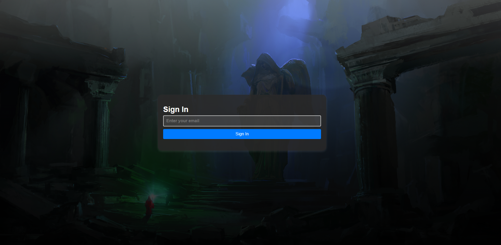

2. This is the Generated Home page
 - 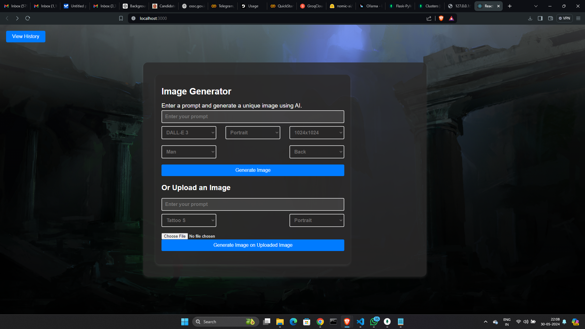

3. Give a prompt and select according to your choice
 - 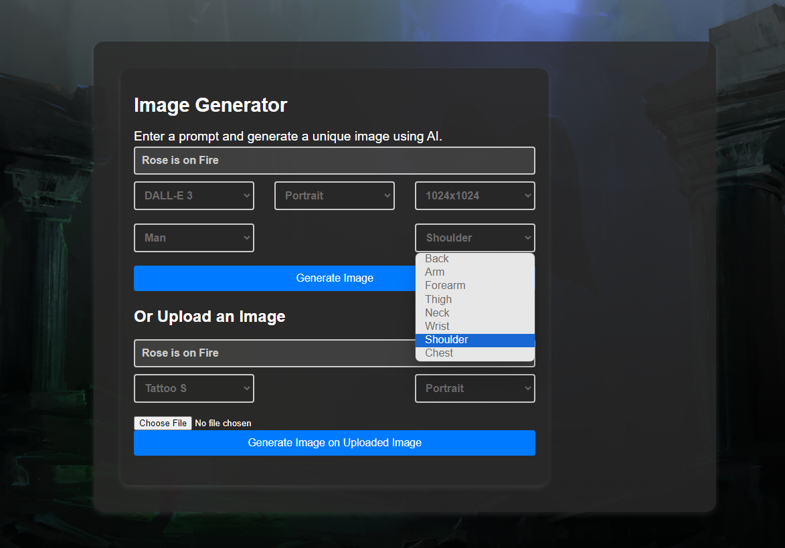

4. Click on generate and a spinner will appear untill image is generated
 - 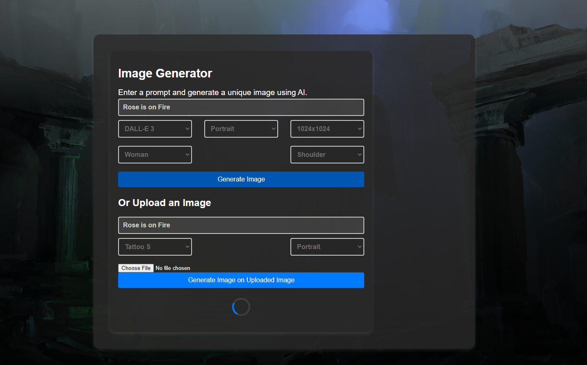

5. Here is the generated image
 - 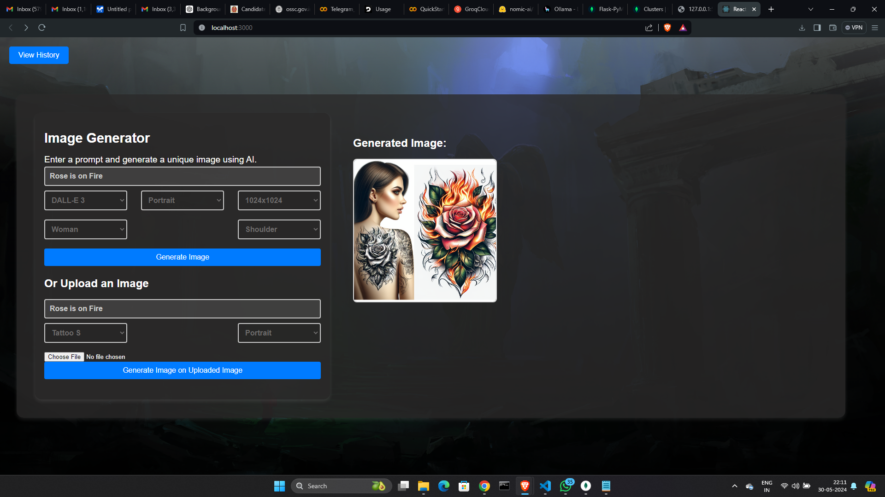

6. For another way you can go for giving a picture of you body part and select style and tattoo size
 - 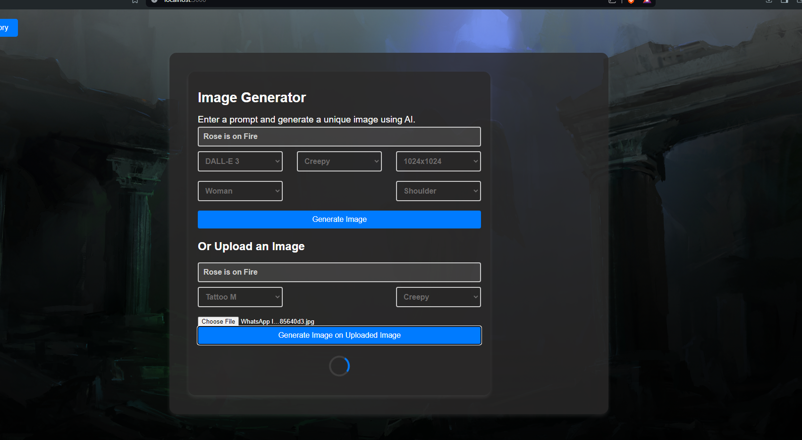

7. Here is the generated image
 - 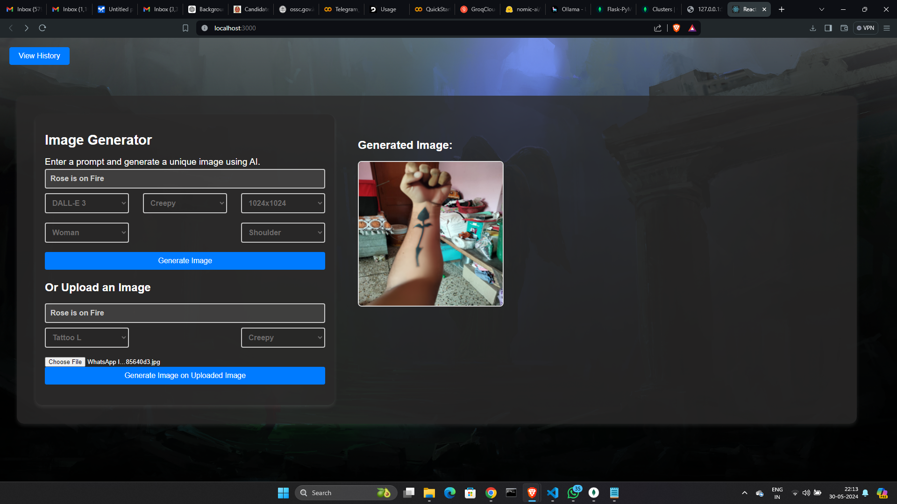

8. By hovering your courser you can download or share the generated image
 - 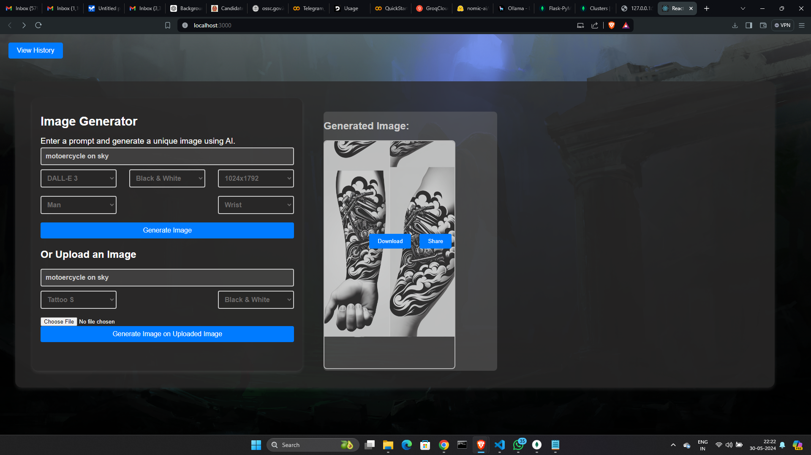

9. All the data are store on the mongoDB database by given mail_id at first step
 - 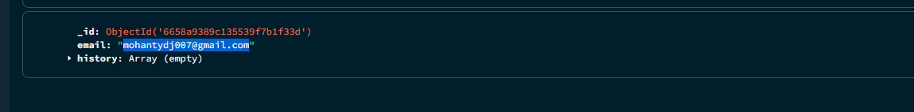

10. It will store all your activity so that you access that easily
 - 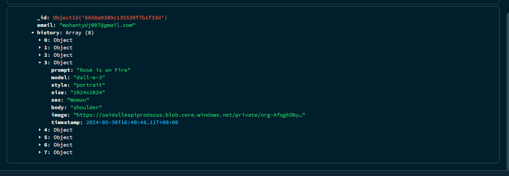

11. You can see your history by clicking on the history button at the top left corner
 - 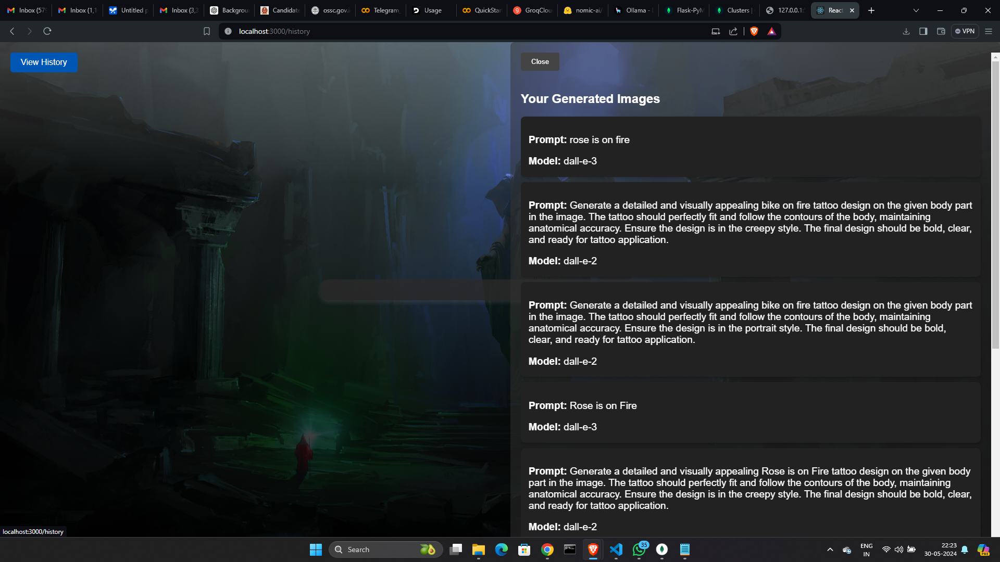

12. These are all your prompts and models history that has been used
 - 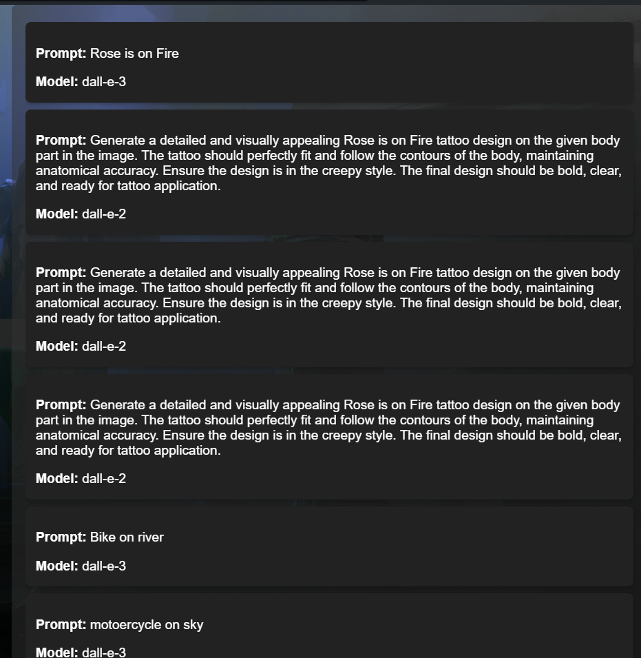

13. For running this website without any problem I am running my frontend and backend at once
 - 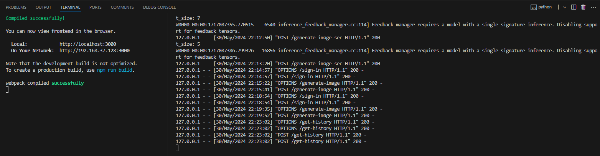

### I am trying to host this website, but due to some technical error I am unable to do it 